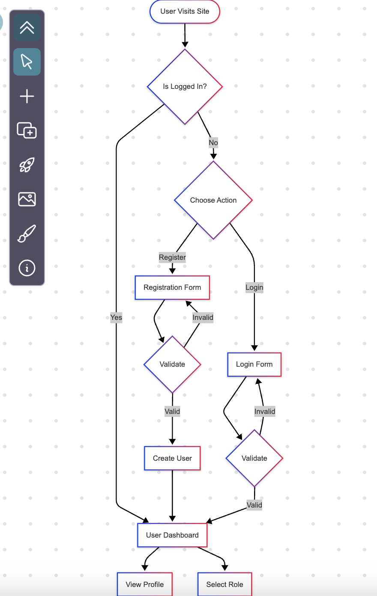
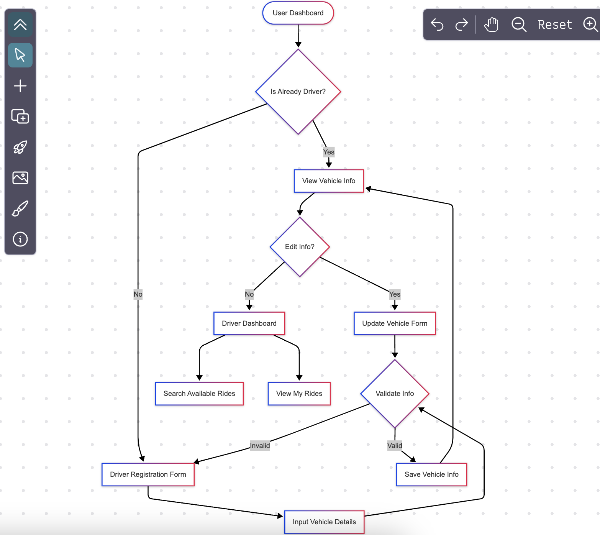
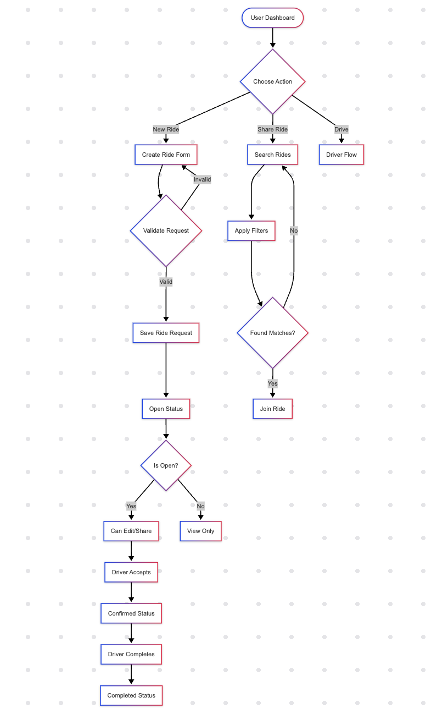
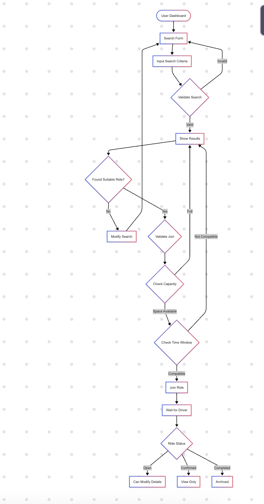
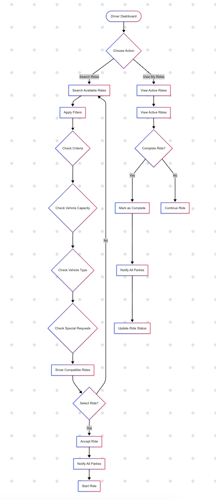

# ERSS-HWK1-AR791-ZL303

## Getting Started

### Directory Structure

```
erss-hwk1-ar791-zl303
    ├── README.md
    ├── auth_flow.png
    ├── driver_operation_flow.png
    ├── driver_registration_flow.png
    ├── request_book_rides_flow.png
    ├── ride_sharing_project
    │   ├── manage.py
    │   ├── ride_sharing_project
    │   │   ├── __init__.py
    │   │   ├── asgi.py
    │   │   ├── settings.py
    │   │   ├── settings.py~
    │   │   ├── urls.py
    │   │   └── wsgi.py
    │   └── rides
    │       ├── __init__.py
    │       ├── apps.py
    │       ├── forms
    │       │   ├── __init__.py
    │       │   ├── auth_forms.py
    │       │   ├── driver_forms.py
    │       │   └── ride_forms.py
    │       ├── models
    │       │   ├── __init__.py
    │       │   ├── ride.py
    │       │   ├── ride_sharer.py
    │       │   ├── user.py
    │       │   └── vehicle.py
    │       ├── services
    │       │   ├── email_service.py
    │       │   ├── ride_service.py
    │       │   └── search_service.py
    │       ├── templates
    │       │   └── rides
    │       │       ├── auth
    │       │       │   ├── login.html
    │       │       │   └── register.html
    │       │       ├── base.html
    │       │       ├── driver
    │       │       │   ├── profile.html
    │       │       │   ├── register.html
    │       │       │   ├── rides.html
    │       │       │   └── search.html
    │       │       └── ride
    │       │           ├── list.html
    │       │           ├── request.html
    │       │           └── search.html
    │       ├── urls
    │       │   ├── __init__.py
    │       │   ├── auth_urls.py
    │       │   ├── driver_urls.py
    │       │   └── ride_urls.py
    │       └── views
    │           ├── __init__.py
    │           ├── auth_views.py
    │           ├── driver_views.py
    │           └── ride_views.py
    └── share_ride_flow.png
```
### Authentication Flow

### Driver Registration Flow

### request and book rides Flow

### share  rides Flow

### Driver Operation Flow

## Project Overview
